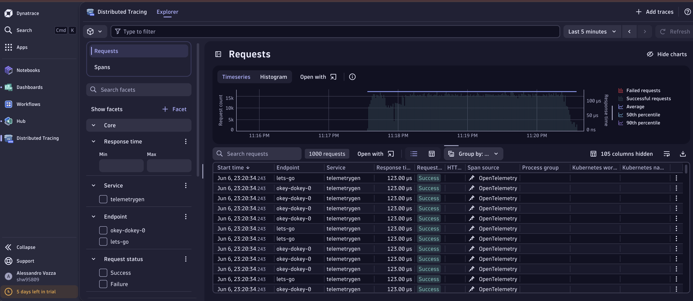

# Dynatrace in Azure Container Apps

## This repository contains the code to deploy Dynatrace in Azure Container Apps.

## Test with telemetrygen

telemetrygen metrics --otlp-http --otlp-endpoint shw95809.live.dynatrace.com:443 --otlp-http-url-path "/api/v2/otlp/v1/metrics"  --otlp-header authorization=\"Api-Token\ $DT_TOKEN\" --duration 600s

telemetrygen logs --otlp-http --otlp-endpoint shw95809.live.dynatrace.com:443 --otlp-http-url-path "/api/v2/otlp/v1/logs"  --otlp-header authorization=\"Api-Token\ $DT_TOKEN\" --duration 600s

telemetrygen traces --otlp-http --otlp-endpoint shw95809.live.dynatrace.com:443 --otlp-http-url-path "/api/v2/otlp/v1/traces"  --otlp-header authorization=\"Api-Token\ $DT_TOKEN\" --duration 600s

## Test with otel-cli
for run in {1..10000}; do otel-cli span \
  --endpoint "https://shw95809.live.dynatrace.com/api/v2/otlp/v1/traces" \
  --otlp-headers "Authorization=Api-Token ${DT_TOKEN}" \
  --protocol http/protobuf \
  --verbose; done

## Container Apps

RG=aca
LOCATION=swedencentral
ENVIRONMENT_NAME=aca-env-dt
OTLP_NAME=otlp-dt
ENDPOINT_URL="https://shw95809.live.dynatrace.com/api/v2/otlp/"

az containerapp env create \
  --name $ENVIRONMENT_NAME \
  --resource-group $RG \
  --location $LOCATION 

az containerapp env telemetry otlp add \
  --resource-group $RG \
  --name $ENVIRONMENT_NAME \
  --otlp-name ${OTLP_NAME}-metrics \
  --endpoint ${ENDPOINT_URL}/v1/metrics \
  --insecure false \
  --headers "Authorization=Api-Token ${DT_TOKEN}" \
  --enable-open-telemetry-traces false \
  --enable-open-telemetry-metrics true \
  --enable-open-telemetry-logs false 

az containerapp env telemetry otlp add \
  --resource-group $RG \
  --name $ENVIRONMENT_NAME \
  --otlp-name ${OTLP_NAME}-traces \
  --endpoint ${ENDPOINT_URL}/v1/traces \
  --insecure false \
  --headers "Authorization=Api-Token ${DT_TOKEN}" \
  --enable-open-telemetry-traces true \
  --enable-open-telemetry-metrics false \
  --enable-open-telemetry-logs false 

az containerapp env telemetry otlp add \
  --resource-group $RG \
  --name $ENVIRONMENT_NAME \
  --otlp-name ${OTLP_NAME}-logs \
  --endpoint ${ENDPOINT_URL}/v1/logs \
  --insecure false \
  --headers "Authorization=Api-Token ${DT_TOKEN}" \
  --enable-open-telemetry-traces false \
  --enable-open-telemetry-metrics false \
  --enable-open-telemetry-logs true 
