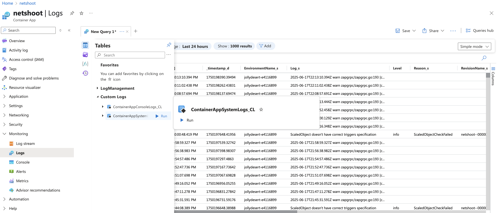

# Testing from ACA

Use the `nicolaka/netshoot` image (using `-c 'while true; do sleep 1; done'` to keep the container running) to test connectivity from the Container App to the Dynatrace endpoint.

```sh
az containerapp create \
  --name test-aca \
  --resource-group $RG \
  --environment $ENVIRONMENT_NAME \
  --image nicolaka/netshoot \
  --cpu 0.5 \
  --memory 1.0Gi \
  --command 'while true; do sleep 1; done' \
  --target-port 80
```

Then, use the `az containerapp exec` command to run commands inside the container:

```sh
export ENDPOINT_URL="https://shw95809.live.dynatrace.com/api/v2/otlp"
export DT_TOKEN=your_dynatrace_api_token_here
az containerapp exec \
  --name test-aca \
  --resource-group $RG \
  --exec-command "curl -v -X POST -H 'Authorization: Api-Token $DT_TOKEN' ${ENDPOINT_URL}/v1/metrics"
```

```sh
telemetrygen logs --otlp-http --otlp-endpoint shw95809.live.dynatrace.com:443 --otlp-http-url-path "/api/v2/otlp/v1/logs" --otlp-header "authorization=Api-Token $DT_TOKEN" --duration 600s

telemetrygen traces --otlp-insecure --otlp-endpoint k8se-otel.k8se-apps.svc.cluster.local:4317 --duration 60s

for run in {1..10000}; do otel-cli span \
  --endpoint $CONTAINERAPP_OTEL_TRACING_GRPC_ENDPOINT \
  --protocol http/protobuf \
  --verbose; done

for run in {1..10000}; do cat payload_metrics.otlp.json | grpcurl -d @ -proto protos/opentelemetry/proto/collector/metrics/v1/metrics_service.proto -plaintext -import-path protos -vv k8se-otel.k8se-apps.svc.cluster.local:4317 opentelemetry.proto.collector.metrics.v1.MetricsService/Export; done

for run in {1..10000}; do cat payload_logs.otlp.json | grpcurl -d @ -proto protos/opentelemetry/proto/collector/logs/v1/logs_service.proto -plaintext -import-path protos -vv k8se-otel.k8se-apps.svc.cluster.local:4317 opentelemetry.proto.collector.logs.v1.LogsService/Export; done
```

# Example error outputs

```text
export ENDPOINT_URL=https://shw95809.live.dynatrace.com/api/v2/otlp
# = transport: Error while dialing: dial tcp: address shw95809.live.dynatrace.com/api/v2/otlp/v1/traces: missing port in address

export ENDPOINT_URL=https://shw95809.live.dynatrace.com:443/api/v2/otlp
# = transport: Error while dialing: dial tcp: address tcp/443/api/v2/otlp/v1/traces: unknown port

export ENDPOINT_URL=https://shw95809.live.dynatrace.com:443
# = "transport: Error while dialing: dial tcp: address tcp/443/v1/traces: unknown port"

export ENDPOINT_URL=shw95809.live.dynatrace.com:443
```

## Logging



Use the Logs link under Monitoring in the Azure Portal to view logs from the Container App. Select the table "ContainerAppSystemLogs_CL" under Customer Logs to see the logs generated by the Container App Otel collector. Usually this is the best place to start troubleshooting why telemetry is not being sent to Dynatrace.